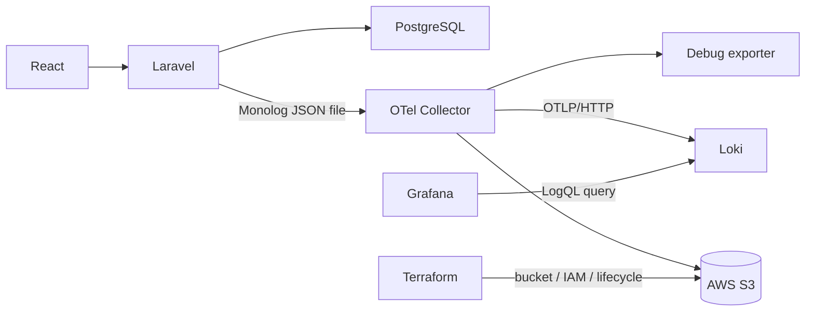

# OpenTelemetry Logging Pipeline Demo

Laravel 12が出す通常のMonolog JSONをOpenTelemetry Collector Contribで収集・正規化し、debug exporterとAWS S3へ送るPhase 1の学習環境です。Laravel向け専用ログ製品ではなく、将来Go・NestJS・Rust・Pythonも接続する **framework-independent observability pipeline** を検証します。

## Architecture



| Component | Responsibility |
|---|---|
| Laravel | 何が起きたかをアプリケーション語彙でJSON出力する |
| Collector | parse、redact、normalize、resource付与、routeを行う |
| Loki | 正規化済みOTelログをローカルvolumeへ保存し、LogQL検索を提供する |
| Grafana | LokiのログをExplore・ダッシュボードで検索・可視化する |
| Terraform | Bucket・暗号化・Lifecycle・最小IAM権限を再現可能にする |
| S3 | 検索エンジンではなく、監査・長期保存・再分析の原本を持つ |

Laravel専用OTelパッケージは使いません。Phase 1ではログを完成させ、traceは導入しません。

## Requirements / startup

- Docker / Docker Compose
- make
- AWSを使う場合のみ: Terraform >= 1.9、AWS標準Credential Chain

```bash
cp .env.example .env
make up
```

- React: <http://localhost:5173>
- Laravel API: <http://localhost:8000/api/suppliers>
- Health check: <http://localhost:8000/up>
- Grafana: <http://localhost:3000> （ユーザー名: `admin`、パスワード: `admin`）

Grafana の既定パスワードは `.env` の `GRAFANA_ADMIN_PASSWORD` で変更できます。これはローカルのデモ構成です。本番環境では強いパスワードと適切な認証・認可を設定してください。

`collector-init` は永続化ボリュームを Collector の実行ユーザー（UID 10001）が書き込めるように初期化する一回限りの補助サービスです。Collector を root で実行しないために必要であり、`Exited (0)` と表示されるのは正常です。

## Grafana / Loki でログを確認する

Collector は正規化済みログを debug exporter に加えて Loki のネイティブ OTLP endpoint へ送信します。Grafana へログインし、左メニューの **Explore** でデータソース `Loki` を選びます。まずは次の LogQL で全ログを確認できます。

初めて使う場合は、起動から検索までを説明した [Grafana ガイド](docs/grafana/README.md) を参照してください。

```logql
{service_name="otel-laravel-demo"}
```

OTel属性は Loki の Structured Metadata として保存されます。例えばアクセスログだけを見るには次を使います。

```logql
{service_name="otel-laravel-demo"} | app_log_type=`http_access`
```

`app_request_id` で特定リクエストの domain log と access log を横断して絞り込むこともできます。Loki / Grafana の起動ログは `make grafana-logs`、Collector の標準出力は `make collector-logs` で確認できます。

```bash
curl -s http://localhost:8000/api/suppliers
curl -s http://localhost:8000/api/suppliers/1
curl -i -X POST http://localhost:8000/api/suppliers \
  -H 'Content-Type: application/json' \
  -d '{"name":"New Supplier","email":"new@example.com"}'
```

レスポンスにはアプリケーション側の `X-Request-ID` が付きます。

## Laravel raw log

LaravelはSemantic Conventionsを知らず、MonologのJSONを日次ローテーション（14ファイル保持）で出します。

```json
{
  "message": "request completed",
  "context": {
    "request_id": "434ef4e3-bfb7-4d50-a71a-20257a4dfc16",
    "log_type": "http_access",
    "method": "GET",
    "url": "http://localhost:8000/api/suppliers/1",
    "route": "/api/suppliers/{id}",
    "status_code": 200,
    "duration_ms": 42.7,
    "ip": "192.168.65.1",
    "user_id": null
  },
  "level": 200,
  "level_name": "INFO",
  "channel": "local",
  "datetime": "2026-09-08T00:00:00.000000+00:00",
  "extra": {}
}
```

Supplier取得・作成時はHTTP access logとは別に `Supplier fetched` / `Supplier created` というdomain logを出します。

## Collector normalization

```bash
make collector-logs
```

概念的な変換結果です。debug exporterの実表示はOTel内部構造で複数行になります。

```json
{
  "timestamp": "2026-09-08T00:00:00.000Z",
  "severity_text": "INFO",
  "severity_number": 9,
  "body": "request completed",
  "resource": {
    "service.name": "otel-laravel-demo",
    "service.namespace": "otel-demo",
    "service.version": "0.1.0",
    "deployment.environment.name": "local"
  },
  "attributes": {
    "http.request.method": "GET",
    "http.route": "/api/suppliers/{id}",
    "http.response.status_code": 200,
    "url.full": "http://localhost:8000/api/suppliers/1",
    "client.address": "192.168.65.1",
    "app.request.id": "434ef4e3-bfb7-4d50-a71a-20257a4dfc16",
    "duration_ms": 42.7
  }
}
```

Processor順:

1. `transform/redact`: `password`、`authorization`、`cookie`、`token`、`access_token`、`refresh_token` を削除
2. `transform/normalize`: Monolog bodyをOTel Body・Severity・Attributesへ変換
3. `resource/common`: service/deployment情報をResourceへ付与
4. `batch`: debug/S3送信をまとめる

アプリでも秘密情報を出さないことが第一防御です。Collector redactionは第二防御であり、自由文message内の秘密を完全検出するDLPではありません。

| Monolog | OTel Severity Number |
|---|---:|
| DEBUG | 5 |
| INFO | 9 |
| NOTICE | 10 |
| WARNING | 13 |
| ERROR | 17 |
| CRITICAL | 21 |
| ALERT | 22 |
| EMERGENCY | 24 |

`request_id` は1 HTTP requestのアプリIDです。Phase 2で導入する `trace_id`（分散trace全体）や `span_id`（処理単位）へrenameしません。

## AWS / Terraform

```bash
cp infrastructure/terraform/environments/dev/terraform.tfvars.example \
   infrastructure/terraform/environments/dev/terraform.tfvars
# bucket_nameを世界で一意な名前へ変更
make tf-init
make tf-fmt
make tf-validate
make tf-plan
make tf-apply
make tf-output
```

作成対象:

- private S3 bucket / BucketOwnerEnforced
- Public Access Block（4項目すべてtrue）
- SSE-S3暗号化とTLS強制bucket policy
- Standard-IA 30日、Glacier 90日、既定365日削除のLifecycle
- `logs/*` への `PutObject` を中心にしたCollector IAM policy
- 明示したprincipalがある場合だけAssumeRole用IAM role

IAM UserやAccess Keyは生成しません。ローカルPoCは既存の `AWS_PROFILE` 等へTerraform出力のpolicyを付与してください。本番ではworkload role / OIDCを使います。stateはPoCではlocalですが、Productionでは暗号化・lockingを備えたremote backendへ移行します。

## S3 export

Terraform apply後に実行します。Bucket名とRegionは `terraform output` からMakefileが読み取り、明示的な環境変数があればそちらを優先します。

```bash
make aws-up
make collector-logs
```

```text
logs/environment=local/service=otel-laravel-demo/year=2026/month=09/day=08/hour=09/otel-logs-<uuid>.json.gz
```

AWS S3 exporterはalphaで、`otlp_json` marshalerはbatch単位のOTLP JSONを保存します。本PoCはgzip圧縮された `.json.gz` であり、厳密な「1行 = 1 event」のNDJSONではありません。独自Lambda等を足すより、Collector標準部品の制約を明示する方を優先しました。Athena/DuckDBへ直接最適化する段階でencoding extensionや別sinkを再評価します。

## Failure / delivery test

filelog receiverのoffsetは `file_storage`、S3 exporterの送信queueも永続Docker volumeへ保存します。

```bash
curl -s http://localhost:8000/api/suppliers/1 >/dev/null
docker compose stop collector
curl -s http://localhost:8000/api/suppliers/2 >/dev/null
curl -s http://localhost:8000/api/suppliers/3 >/dev/null
docker compose start collector
make collector-logs
```

- Collector停止はLaravel / PostgreSQL / Reactのavailabilityへ影響しない。
- ログファイルとoffset volumeが残る限り、再起動後に未読分を回収する。
- 正常停止でもexport直前の境界ではat-least-onceとなり、重複し得る。下流は `app.request.id` 等で重複排除を検討する。
- 強制kill・storage破損では最後に永続化したoffsetまで戻り、重複し得る。
- Collector停止が14日を超えて対象ローテーションファイルが削除されれば欠損する。
- Docker volumeを削除するとoffsetを失い、残存ファイルを先頭から再読して重複する。
- S3 exporterのqueueはCollector再起動時の未送信データを永続化する。ただしalpha exporterは共通の無期限 `retry_on_failure` を持たないため、AWS SDKの10回retryを使い切った送信失敗は欠損し得る。

これはexactly-once保証ではありません。保証を誇張せず、欠損・重複条件を観察可能にするPoCです。

## Tests

```bash
make test
make smoke-test
```

| Test | Verification |
|---|---|
| 1–3 | Feature test / smokeでAPI・PostgreSQL・JSON logを確認 |
| 4–7 | debug exporterで収集・normalize・Resource・domain fieldを確認 |
| 8–9 | `terraform validate/plan` とAWS上の暗号化/Public Access Blockを確認 |
| 10–11 | `make aws-up`、S3 object、IAM policy JSONを確認 |
| 12–14 | Failure手順でavailability・再読・欠損/重複条件を確認 |
| 15 | `make tf-destroy` 後にbucket等が削除されたことを確認 |

AWS apply/destroyと実S3転送はcredential・課金を伴うintegration testなので自動実行しません。

## Stop / destroy

```bash
make down
make tf-destroy
```

S3にobjectsが残っているとTerraformは安全のため削除に失敗します。内容を確認して明示的に空にしてください。意図しないログ消去を避けるため `force_destroy = true` にはしていません。

## Phase 2 / 3

Phase 2でOpenTelemetry PHP SDKによるtrace、Phase 3でlogへ `trace_id` / `span_id` を付与して相関します。SDK依存はInfrastructure adapter境界へ閉じ込めます。最終的にはCollectorをGatewayとしてLoki・Tempo・Prometheus等へrouteできる構成を目指します。

## References

- [OpenTelemetry Logs](https://opentelemetry.io/docs/concepts/signals/logs/)
- [OpenTelemetry Collector overview](https://opentelemetry.io/docs/collector/)
- [OpenTelemetry Collector configuration](https://opentelemetry.io/docs/collector/configuration/)
- [OpenTelemetry Collector Contrib components](https://github.com/open-telemetry/opentelemetry-collector-contrib/tree/main/README.md)
- [AWS S3 Exporter](https://github.com/open-telemetry/opentelemetry-collector-contrib/tree/main/exporter/awss3exporter)
- [File Log Receiver](https://github.com/open-telemetry/opentelemetry-collector-contrib/tree/main/receiver/filelogreceiver)
- [File Storage Extension](https://github.com/open-telemetry/opentelemetry-collector-contrib/tree/main/extension/storage/filestorage)
- [Transform Processor / OTTL](https://github.com/open-telemetry/opentelemetry-collector-contrib/tree/main/processor/transformprocessor)
- [Debug Exporter](https://github.com/open-telemetry/opentelemetry-collector/tree/main/exporter/debugexporter)
